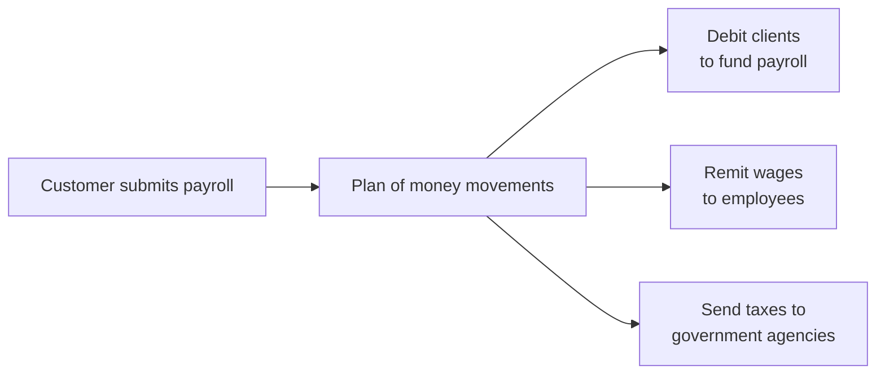
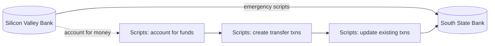
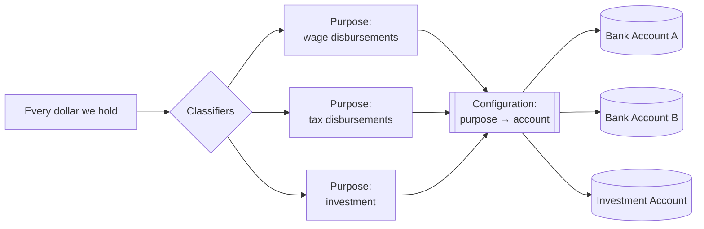
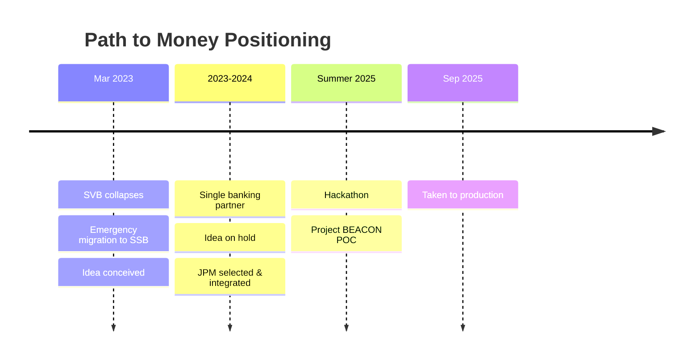
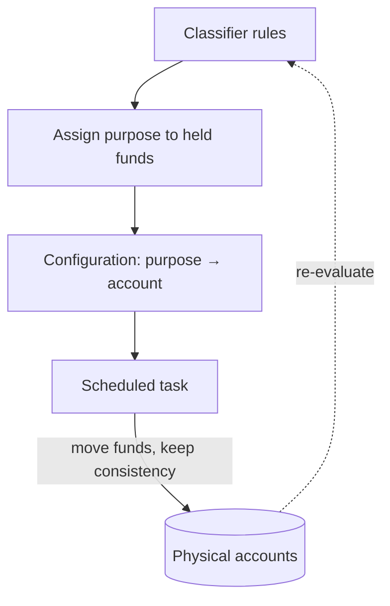
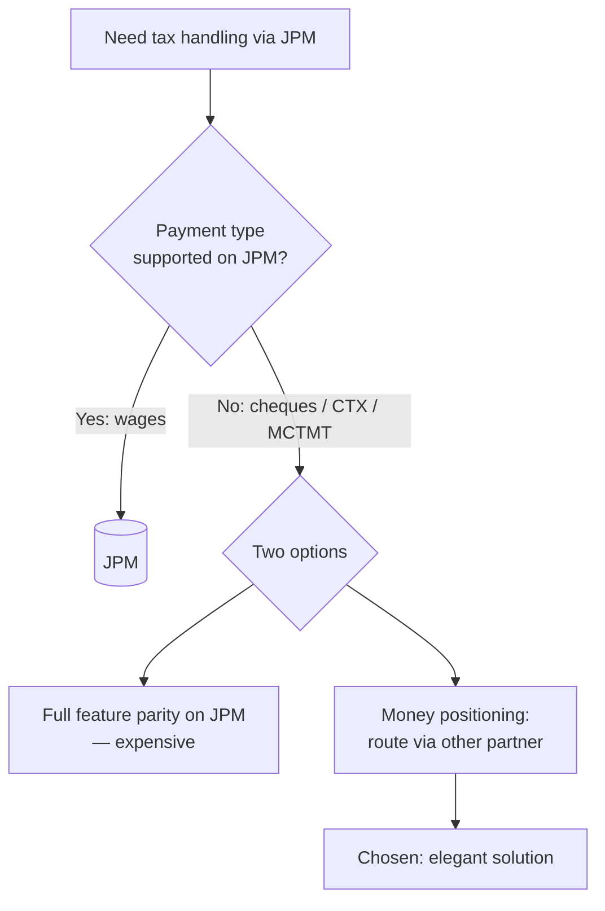

# Money Positioning Presentation

## Purpose

The purpose of this project is to create a single page HTML file `index.html` that will serve as the slides for a presentation on a money positioning project that I worked on. When the user opens the file, he should be able to navidate though the content in steps, simularly to a Powerpoint presentation, but with more liveliness and more variability. The general style of the presentation is described below. This `README.md` should fully describe the content of the presentation. I.E., if you would want to re-generate `index.html` from scratch, you could fully do so by utilizing the content of this file and the presentation should be relatively similar (except for style details).

## Presentation Style

This is the original design brief for the repo's shared titanium deck style; the generic
style and its reusable engine are now captured in the **`presentation` skill**
(`.claude/skills/presentation/`).

Presentation flow:

- the presentation should take advantage of the whole screen / window
- it should be separated into pages, that the user can navigate though
- each page should have a clear continuation navigational element
- use creativity in the look and positioning of those navigational elements, but generally they should be towards one edge of the screen
- transition to next page should be animated and slide in the direction of the navigational element

Look and feel:

- background should be dark, surfaces should have a metalic sheen to them with a slight blue/grey/silver tint as people woud associate with Titanium
- use engineering themed graphics in the backround - think of "graphing paper", "graphing table", "schematics"
- make navigational and active elements lively - they should react to mouse proximity

## Presentation Content

The presentation is sourced from [narrative.md](narrative.md). It is organized into the
sequence of slides below. Each slide lists its heading, the on-screen copy (kept concise —
speaker elaborates verbally), and any visual element. Mermaid diagrams are used where a
concept is structural, sequential, or temporal. When rendered in `index.html`, these
diagrams may be reproduced as native animated SVG/HTML rather than literal Mermaid, but the
structure below is the source of truth.

### Implementation (`index.html`)

The presentation is implemented as a single self-contained `index.html` file (no external
dependencies). It realizes the slides above with the following behavior (eight slides are shown; the
Interlude, Hackathon, and Production slides are preserved in the code but hidden, so they are not
navigated or counted):

- **Titanium deck engine (shared style)** — the paged deck, horizontal `translateX` navigation
  (chevrons, progress ticks, keyboard, touch-swipe), the scrolling graph-paper grid, the live
  mouse-reactive schematic `<canvas>` background, the metallic cards, and the animated reveals
  are the repo's shared presentation style, documented with reusable example decks in the
  **`presentation` skill** (`.claude/skills/presentation/`). Project-specific notes:
  - **Hidden slides** — the Interlude, Hackathon, and Production `<section>`s carry a `slide-off`
    class (`display:none`) so they are excluded from the navigation, progress bar, and slide
    count, but preserved in the code and documentation.
  - **Animated SVG diagrams** — a small JS engine (`buildFlow` / `buildTimeline`) renders each
    Mermaid spec as native SVG with node types `box`, `db` (cylinder), `decision` (diamond),
    and `config` (double-border); edges animate in on slide entry and replay each time their
    slide becomes active. The Interlude uses a bespoke horizontal timeline; the closing slide
    reuses the indirection ("purpose") diagram rather than a new one.
- **Payroll Execution Demo (pull-up slide)** — a self-contained interactive demo (`#demoPanel`)
  that slides up over the deck from the bottom while the deck shifts up and dims. It is opened by
  any `[data-demo-open]` trigger — the "Payroll Execution Demo" button on Slide 2 (without money
  positioning) and on the closing "Where It Stands" slide (with money positioning, via the
  `data-demo-purpose` attribute) — and closed with its **✕** button or `Esc`; while it is open the deck's keyboard navigation is
  suspended. The panel is built once and never torn down, so its state persists for the whole
  presentation. Inside, an SVG diagram lays out the three columns from `payroll-demo.md` (client
  companies → payroll banks → employee/tax-agency recipients) with faint connecting arrows.
  Clicking a **bank** toggles it active/inactive (darkened, and arrows from it dim); clicking a
  **company** opens a payroll overlay to enter per-employee earnings. Running payroll generates
  **ledgers** — funding (client→configured bank, T+1), wage disbursements (bank→employee, 60%,
  T+4), and per-jurisdiction tax disbursements (bank→agency, by rate and due date) — each drawn
  as a labelled box riding the line between its accounts, a quarter of the line's length from the
  near node: yellow and near the source while pending, then on its due date it glides along the
  line toward the destination while its colour transitions yellow→green. From 10 days past due it
  fades toward a dark grey while going transparent, and at 17 days past due it is removed from the
  system entirely (no longer affecting the stacking offset of other ledgers). Co-located ledgers stack *along* the
  line in 2-percentage-point steps with the newest painting on top: while pending they sit at
  25%, 27%, 29%… (newest pinned nearest the "from" node); once settled they mirror to 75%, 73%,
  71%… (newest cascading back toward the "from" node). A calendar control advances the day,
  re-settling every ledger with an animated transition along its line.
- **Payroll runs** — every payroll run gets a monotonically incrementing **payroll ID** (starting
  at 1), stamped on each ledger it creates. The run-payroll overlay lists buttons for the
  *current* runs **of that company** — a run is current while at least one of its ledgers is still
  on the diagram (i.e. not yet retired at 17 days past due); once a run's ledgers have all
  disappeared it drops off the list. Clicking a run button opens a ledger-list overlay showing that run's ledgers in a
  five-column table — From, To, Due date, Amount, and a miniature of the ledger box (rendered with
  the same tint as on the diagram) — ordered by due date with the earliest on top.
- **Re-positioning funds (drag & drop)** — any **not-yet-settled** ledger whose **from** account is
  one of the payroll banks (wage and tax disbursement ledgers, not client funding) can be dragged —
  this includes red **blocked** ledgers. Dropping it onto a different payroll bank reassigns the
  ledger's `from` to that bank (it then rides the new line). A blocked ledger dragged onto an active
  bank stays red for the rest of the day and settles to green on the next day advance (settling only
  ever happens on day progression, never mid-day). On a successful re-assignment an audit-warning overlay pops
  up — a worried stick figure beside the message: *"Did we actually move the money to support
  paying out the amount out of the new bank account? And if we did, did we record it in the system?
  Otherwise our audits will detect that things are not in balance."* — a reminder that the
  positioning move must be backed by a real transfer and recorded, or the books won't balance.
- **Inactive banks block settlement** — a ledger can only settle once it is due *and* its source
  bank is active. If a ledger comes due while its source payroll bank is inactive it does **not**
  settle: it stays in its pending (left) position and is tinted **red** instead of green. Once a
  ledger has settled it stays settled (latched), so deactivating a bank afterwards won't pull a
  completed ledger back. Settling only ever happens on a day advance — reactivating a bank (or
  dragging a blocked ledger onto an active bank) leaves it red until the **next** day advance, when
  it settles. Blocked (red) ledgers remain draggable just like pending ones. While a ledger stays
  blocked its due date is kept recent — bumped forward to **T-1** whenever it would fall further
  behind — so that when it finally settles it appears freshly settled rather than long-expired (and
  doesn't immediately fade out). When a ledger is blocked, its recipient protests:
  - **Employee (wage) ledgers** — on the exact due date (and only that day), an angry stick figure
    appears at the employee node, marches to the deactivated source bank, bangs on it a few times,
    then walks back and disappears.
  - **Tax-agency ledgers** — instead of walking, the figure appears at the agency and shouts via a
    speech bubble: **"5% penalty!"** on the due date, then **"… more penalties!"** every subsequent
    day it remains blocked. The bubble disappears after ~0.7 s and the figure vanishes shortly
    after. (Tax penalties accrue daily, hence the repeat; the wage protest is a one-off.)
- **Greeting a recipient** — clicking an employee or tax-agency node pops a friendly stick figure
  out of the node; it waves and says **"Hello!"** in a speech bubble, then steps back in and
  disappears. **Bianca** greets in French (**"Bonjour!"**). Tax-agency figures (both this friendly
  greeter and the angry penalty figure) wear a little top hat.
- **Company group** — a **Group A / Group B** selector in a "Company Configuration" section of the
  payroll overlay (below the Run Payroll button, and below Active Payroll Runs when present). It is
  a property of the **company**, not of a payroll run: the classifiers always read the company's
  *current* group, so changing it re-affects all of that company's ledgers, including those from
  past payroll runs.
- **Money positioning by "purpose"** — this feature is active only when the demo is opened from a
  slide that requests it (the Slide 5 demo button carries `data-demo-purpose`; Slide 2's does not).
  When active, three header buttons appear: **Classifiers** (cogwheel), **Account Usage**, and **Run
  Money Positioning**, and double-ended **bank-to-bank arrows** are shown for internal transfers:
  straight arrows between adjacent banks (SVB↔ACB, ACB↔BSB), and a wrap-around path for the far
  pair (SVB↔BSB) that runs off the bottom of the diagram and re-enters at the top through small
  "tunnel" portals (the metaphor: the path tunnels from bottom to top).
  - **Configuration overlays** — two separate overlays. The **Classifiers** overlay lists the seven
    **classifiers** (each with a colour swatch) toggled active/inactive (all start inactive, persist
    for the session), and holds the **"Run money positioning automatically"** selector — **Never**,
    **At Beginning of Day** (default), or **Every 4 Seconds** (runs on a 4-second interval while the
    demo is open). The **Account Usage** overlay holds a **purpose → payroll bank account** selector per
    classifier.
  - **Classifiers** (priority order; first active + applicable one wins): *Investment* (from a
    payroll bank, due > T+6), *NM SIT* (to = NM SIT), *NY MCTMT* (to = NY MCTMT),
    *WageDisbursement-GroupA/B* (to = employee, or from = company, of that group),
    *TaxDisbursement-GroupA/B* (to = tax agency, or from = company, of that group).
  - **Execution** — runs at the beginning of each day (if auto is on) or via the Run button. For
    each unsettled ledger it finds the first active applicable classifier, assigns its **purpose**
    (drawn as a small coloured dot at the ledger box's top-right), then compares the ledger's payroll
    bank account to the account configured for that purpose. If they differ, an **internal transfer**
    ledger (due T+1, same payroll run) is created so the books stay balanced: a **disbursement**
    ledger (the payroll bank is the *from*) is **moved** — its `from` is updated and a transfer old → new
    funds the new paying account; a **funding** ledger (the payroll bank is the *to*) is **redirected** — its
    `to` is updated and a transfer new → original moves the money on to where it was originally
    expected. After the pass, opposite transfers within the same payroll run net out: an A→B and a
    B→A transfer of equal amount cancel and are both removed. Transfer ledgers ride the inter-bank
    arrows (the SVB↔BSB pair via the wrap-around tunnel path) and are not themselves re-classified.

---

### Slide 1 — Title

- **Title:** Flexible Money Positioning System
- **Subtitle:** A layer of indirection for moving money safely
- **Footer / attribution:** Project BEACON
- **Visual:** Hero slide. Centered title over the titanium/schematic background. No diagram.
- **Speaker note (subtext on slide):** "The power of invention lies not only in discovering
  something entirely new, but in applying existing concepts in novel ways to decompose and
  simplify complex problems."

---

### Slide 2 — The Problem

- **Heading:** The Problem
- **Body:** My team processed payroll payments for our customers. After a customer
  submitted payroll data, our system generated a *plan of money movements* — transactions
  moving funds from account A to account B.
- **Visual:** Mermaid flowchart of the money-movement plan. The system worked well, but
  lacked flexibility.

- **Demo Access:** A button near the bottom-right of the slide ("Payroll Execution Demo")
  opens the Payroll Execution Demo pull-up slide.

---

### Pull-up Slide — Payroll Execution Demo

- **Heading:** Payroll Execution Demo
- This slide is not included in the linear flow of the presentation. Instead, the slide can be accessed from multiple slides during the presentation by clicking a "Demo" navigation element on the slide. Each slide will explicitly speficy if access to the "Demo" slide should be included on the slide. When the user clicks the "Demo" navigation element, the current slide scrolls up (and dims) and the demo slide comes in from the bottom. Closing it (the **✕** button or `Esc`) reverses the motion. The demo retains its state (current day, bank active/inactive toggles, and all ledgers) for the whole presentation, so it resumes where the user left off regardless of which slide reopened it.

- The content of the slide is described in payroll-demo.md

---

### Slide 3 — March 2023: SVB Collapses

- **Heading:** March 2023 — Silicon Valley Bank Collapses
- **Body:** By Thursday, March 9, it was unclear whether SVB would process any further
  transactions. Treasury directed us to move **all** funds out of SVB immediately.
- **Key figures (stat callouts):**
  - Several days, including the weekend
  - ~1,000,000 transactions updated
  - Funds moved SVB → South State Bank (SSB)
- **Visual:** Mermaid flowchart of the emergency migration.

---

### Slide 4 — The Weakness Exposed

- **Heading:** It Worked — But It Was Fragile
- **Body:** We mitigated our exposure, but moving money quickly required heavy engineering
  involvement. The rescue scripts:
- **Bullet list (problems):**
  - Lived **outside** the product
  - Were **not** covered by automated testing
  - Were **easy to use wrongly**
  - Lacked proper **auditability**
- **Takeaway line:** We needed a simple, configurable money-positioning system to move funds
  between banks safely and transparently.
- **Visual:** No diagram — four "warning" cards.

---

### Slide 5 — Collecting Requirements

(Formerly "The Benefits". Swapped to appear *before* the core-idea slide and reworded to avoid the
term "purpose" — it is framed as requirement gathering: distinct use cases that were each identified
as benefiting from a money-positioning system.)

- **Eyebrow:** Collecting Requirements
- **Heading:** Many uses, one solution
- **Body:** Looking past the immediate crisis, we gathered requirements — and several distinct use
  cases kept pointing at the same thing: a flexible system for positioning money across banks.
- **Bullets (use cases):**
  - **Crisis Management** — reposition money quickly without engineering involvement
  - **Risk Grouping** — group customers for independent risk management (e.g. "group A" vs "group B")
  - **Idle Funds** — sweep idle money into investment accounts
  - **Operational Constraints** — handle the quirks of specific bank accounts ← *this one became
    the driver for production*
- **Visual:** Three "check" cards; highlight the third as the production trigger.

---

### Slide 6 — The Core Idea: Purpose

- **Heading:** The Key Idea — A Layer of Indirection
- **Body:** Decouple the money we hold from the physical accounts holding it. Every dollar
  has a **purpose**. *Classifiers* assign the purpose; a separate *configuration* maps each
  purpose to the physical account where those funds should reside.
- **Emphasis:** Change circumstances? Just update the configuration — the system moves the
  money accordingly.
- **Visual:** Mermaid flowchart of the indirection layer (the heart of the talk).

---

### The Interlude (HIDDEN)

This slide is **hidden** from the deck. It is preserved in the code (its `<section>` carries a
`slide-off` class, which removes it from layout and excludes it from the navigation, progress bar,
and slide count) and in this documentation, but it is not shown — and the slides after it are
renumbered accordingly (so the visible deck has ten slides).

- **Heading:** A Pause — Then a New Partner
- **Body:** With SVB out, we were down to a single banking partner — and money positioning is
  moot with only one bank. JPMorgan Chase (JPM) was chosen as the new partner, and my team
  began integrating with them (a separate project).
- **Visual:** Mermaid timeline placing the idea on hold between SVB and the Hackathon.

---

### The Hackathon (HIDDEN)

This slide is **hidden** from the deck (its `<section>` carries a `slide-off` class) — preserved in
the code and documentation but not shown or counted.

- **Heading:** The Hackathon — Project BEACON
- **Body:** We wanted to simplify banking-partner configuration and money-movement
  management. I assembled a cross-functional team — engineering, product, and critically
  Jason, our Director of Finance and Risk — so any prototype would meet treasury
  requirements and have a viable path to production.
- **Two focus areas:**
  - A **UI** for banking-partner configuration (most of the effort)
  - The **money-positioning engine** (my proof-of-concept)
- **POC contents:** classifier rules to assign purpose · configuration mapping purposes to
  accounts · a scheduled task to move funds while maintaining consistency.
- **Demo classifiers:** wage funds, tax funds, cheque payments, investment funds.
- **Tagline:** Built and demoed in a dev environment in just a few days.
- **Visual:** Mermaid flowchart of the BEACON engine loop.

---

### Taking It to Production — JPM gaps (HIDDEN)

This slide is **hidden** from the deck (its `<section>` carries a `slide-off` class) — preserved in
the code and documentation but not shown or counted. Its narrative is now carried by the visible
"Taking it to Production" slide further below.

- **Heading:** From Hackathon to Production Priority
- **Body:** In September 2025 we needed tax-fund handling through JPM. Wage disbursements via
  JPM already worked, but some tax payment types did not:
- **The gaps:**
  - Physical **cheques** and **CTX payments** — required for **NM SIT** (New Mexico state
    income tax)
  - **NY MCTMT** — must be paid as a single cheque for all client liabilities → all related
    funds must reside in the **same** bank
- **The choice:** full feature parity on JPM (expensive) **vs.** route these payments through
  our other banking partner via money positioning.
- **Decision:** Money positioning solved both issues elegantly.
- **Visual:** Mermaid decision flowchart.

---

### Slide 7 — Taking it to Production

(Formerly "Safe Launch". The original "Taking It to Production / JPM gaps" slide is hidden; this
slide now carries the production-rollout story. Styled with slide-5 "check" bullet lists, no diagram.)

- **Heading:** Taking it to Production (no top eyebrow)
- **Body:** One engineer hardened the POC, another updated the UI. Three sprints, three classifier
  rules: NM SIT, cheque payments, NY MCTMT.
- **Design Decisions** (first "check" list under a "Design Decisions" eyebrow):
  - **Dark Launch** — shipped dormant first / enable / gradual rollout
  - **Idempotent** — operations can be safely re-run without moving money twice
  - **Request Cache** — optimizations to make it run in ~20min on the whole corpus
- **Tradeoffs** (a second "check" list under a "Tradeoffs" eyebrow):
  - **No Classifier UI** — consciously avoided; classifiers implemented in Python
  - **Start Narrow** — begin with classifiers for the immediate needs (NM SIT, cheque payments, NY MCTMT)
- **Visual:** No diagram — two bullet lists (Design Decisions, Tradeoffs).

---

### Slide 8 — Where It Stands / Closing

- **Heading:** Clean, Predictable, Testable
- **Body:** The system runs entirely on the backend. I intentionally kept UI-based classifier
  configuration out of scope to preserve simplicity and testability. Adding new rules still
  needs engineering, but the system stays clean and predictable. Today it runs with three
  classifier rules and ample room to expand.
- **Closing line (large):** Introducing the simple concept of **"purpose"** let us decompose
  a complex operational challenge into a set of clear, elegant rules.
- **Demo Access:** A button near the bottom-right of the slide ("Payroll Execution Demo") opens the
  Payroll Execution Demo pull-up slide with the "purpose" (money-positioning) feature active. (Moved
  here so the live demo closes the talk.)
- **Visual:** Callback to the Slide 6 indirection ("purpose") diagram, dimmed, with the closing
  line overlaid. No new diagram.